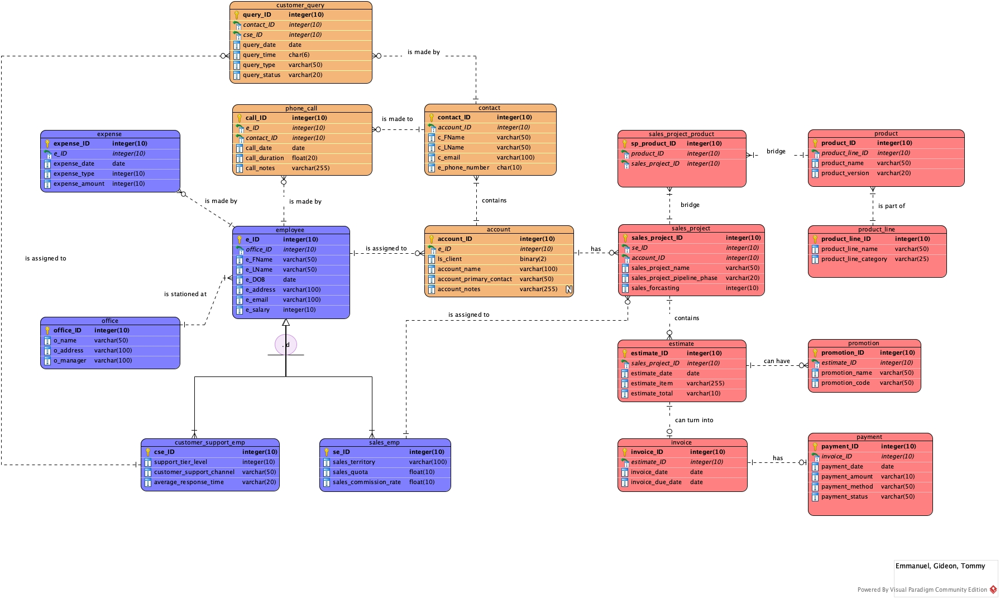

# MtlTech Relational Database Project

## Introduction
This repository contains the code and data for a relational database project developed for MtlTech, a fictional technology company serving various municipalities in Quebec. The project was developed as part of the MSCA 690 Data Management course and involves the creation, implementation, and analysis of a database system to support business operations and decision-making.

## Database Design
The database design includes multiple tables representing different entities such as employees, offices, customer support, sales, products, and more. The ERD (Entity-Relationship Diagram) below provides an overview of the database structure:



## SQL Scripts
The following SQL scripts are used to create and populate the database:

### Create Database and Tables
```sql
CREATE DATABASE MtlTech;
USE MtlTech;

-- Table creation scripts (examples)
CREATE TABLE office (
    office_ID INT PRIMARY KEY,
    employee_ID INT,
    name VARCHAR(50),
    address VARCHAR(100),
    manager VARCHAR(100)
);

CREATE TABLE employee (
    e_ID INT PRIMARY KEY,
    eFName VARCHAR(50),
    eLName VARCHAR(50),
    eDOB DATE,
    e_address VARCHAR(100),
    e_email VARCHAR(100),
    e_salary DECIMAL(10,2)
);

-- (Add the rest of the table creation scripts here)
